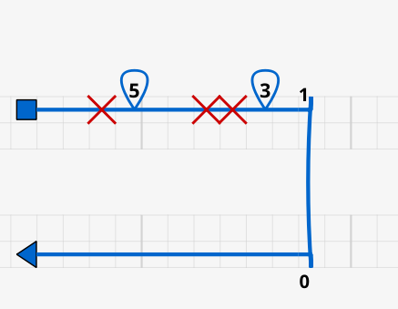
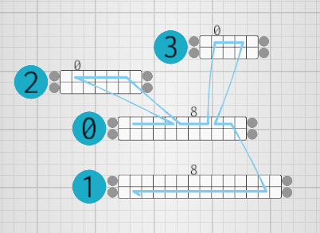
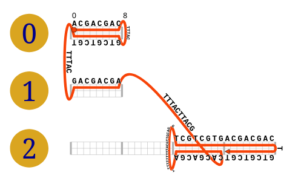
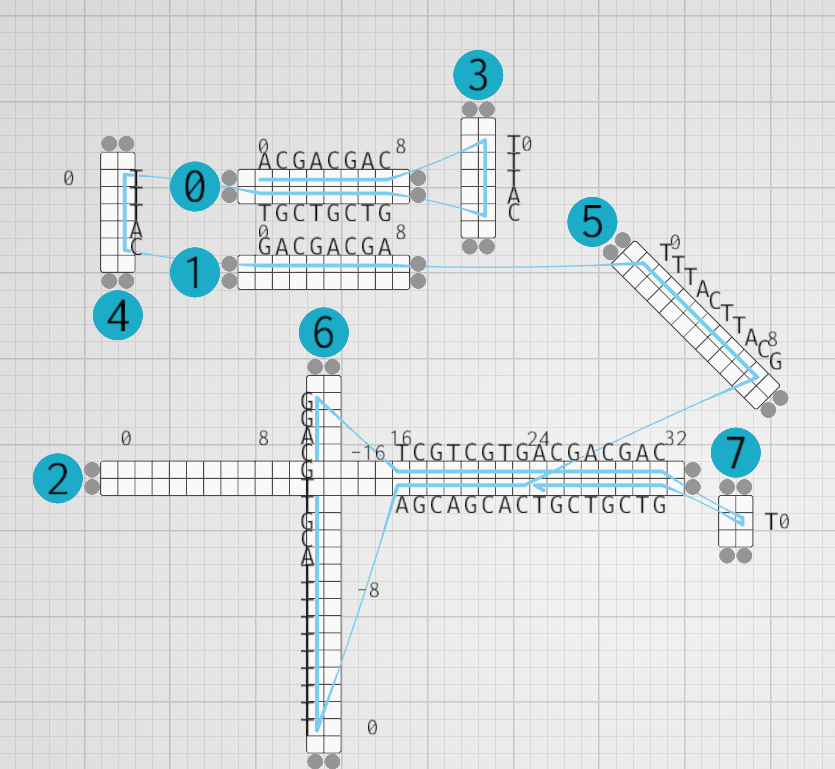

# About

ENSnano is a software for designing DNA nanostructures. 

ENSnano takes up the concepts of existing DNA nanostructures design softwares such as
[cadnano](https://cadnano.org/) and extends them with additional features. Notable features of
ENSnano include

* A 3D editable view synchronized with a 2D cadnano-like interface
* 3D and 2D cross-over recommendations based on the structure's geometry
* An interactive and geometry aware copy and paste functionality

Currently, ENSnano can only produces sequences for DNA origamis.

For more details about ENSnano you can checkout the paper introducing it in the proceedings of the
[DNA27 conference](http://dna27.iopconfs.org/home): 

> <ins> ENSnano: a 3D modeling software for DNA nanostructures </ins>
   Nicolas Levy and Nicolas Schabanel.
   DNA 2021 *Proceedings of the 27th International Conference on DNA Computing and Molecular Programming*
   [ [pdf](https://drops.dagstuhl.de/opus/volltexte/2021/14672/pdf/LIPIcs-DNA-27-5.pdf) ]

You can also see [here](https://www.youtube.com/watch?v=NPH-ukYMhdY) the talk presented at
the conference.

# Installation

We try to frequently release binaries for Windows and MacOS.

Alternatively you can clone this repository and build the software from source, following instructions below:

## Dependencies 

### All platforms

You need to have the latest Rust compiler installed. See this [page](https://www.rust-lang.org/tools/install).

*Note: If you already have Cargo installed but face compilation issues, make sure that you have the latest version by running*
```Shell
rustup update
```

### Linux

You need the GTK3 development packages and a C++ compiler to build the [RFD](https://crates.io/crates/rfd) dependency.

* Debian/Ubuntu: `apt-get install build-essential libgtk-3-dev`

* Fedora: `dnf install gtk3-devel`

* Archlinux: `pacman -S gtk3`

You also need to have the **Vulkan** driver for your graphic card installed. The installation method depends on your distribution and graphic card,
but there should be a tutorial on the internet for any combination of those.

## Compiling from source

Clone the repository:

```Shell
git clone https://github.com/thenlevy/ensnano.git
```

Then run ENSnano with:

```Shell
cd ensnano
cargo run --features=log_after_renderer_setup --release
```

# Importing Cadnano/Scadnano files

ENSnano does not currently handles deletions/loops/insertions in its designs. Here is how these features are handled
when importing a cadnano/scadnano file

* The nucleotides that are "deleted" are removed from the design
* Insertions are replaced by a single strand on an attributed helix

## Example

In this cadnano design, deleted nucleotides are removed and loops are replaced by single strands

 

In this scadnano design, insertions and loopouts are replaced by single strands

 

# Troubleshooting

## Compilations errors
Compilation errors may be happen when using an outdated version of the rust compiler. To solve this run
```Shell
rustup update
```
It might also happen that you need to update ENSnano's dependencies before compiling. To do so, run
```Shell
cargo update
```
## Crash at startup on Windows
By default, ENSnano uses a Vulkan renderer on windows platforms that offers
one. However this renderer does not work properly on some machines. For this
reason it is also possible to use a DirectX12 renderer instead. 

If your program crashes on startup, try using the binary
```Shell
ensnano-windows-dx12
```
or, if you are compiling from source, use a DirectX12 renderer with
```Shell
cargo run --release --features="dx12_only log_after_renderer_setup"
```

# Third-party licenses

The licenses of the dependencies are listed in `thirdparties/license.html`

This software uses the following fonts which are distributed under the SIL OpenFont License
* [Inconsolata-Regular](https://fonts.google.com/specimen/Inconsolata)
* [Inter](https://fonts.google.com/specimen/Inter) (Glyphs from this font are used in the file `font/ensnano2.ttf`)

The font `font/DejaVuSansMono.ttf` is in public domain.
