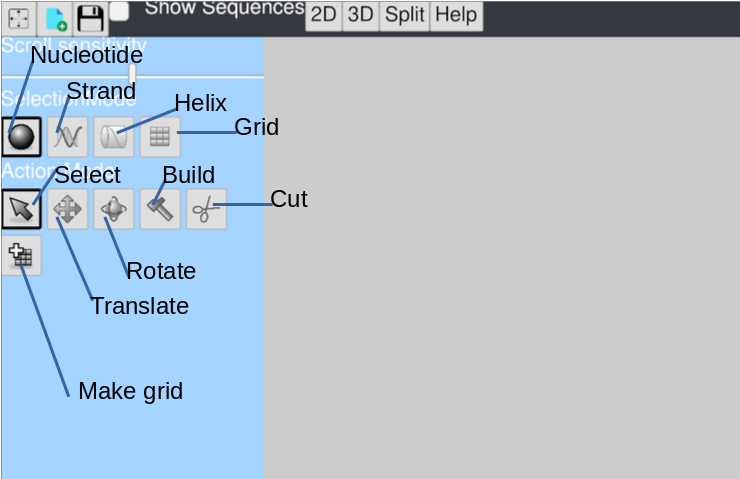
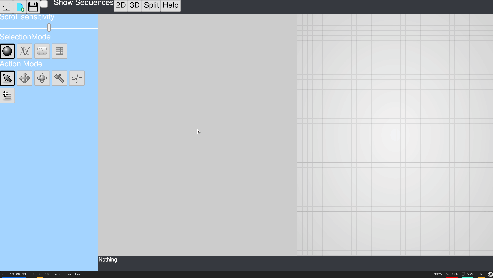
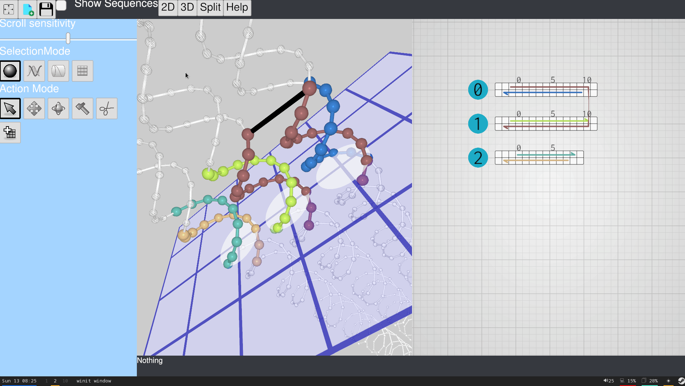
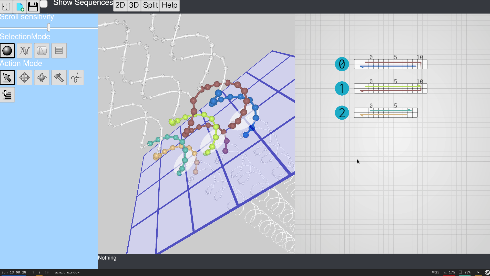

# Dependencies

## All platforms

You need to have the latest rust compiler installed see [this page](https://www.rust-lang.org/tools/install).

** If you already have `cargo` installed but face compilation issue, make sure that you have the lastest version by running `rustup update` **

## Linux
You need the GTK3 development packages to build the dependency `nfd2`.

* Debian/Ubuntu: `apt-get install libgtk-3-dev`
* Fedora: `dnf install gtk3-devel`
* Arch: `pacman -S gtk3`

You also need to have your graphic gards driver installed. The installation methods depends on your distribution and graphic card,
but there should be a tutorial on the internet for any combination of those.

# How to

## Create grids and helices
To create a grid, click the `add_grid`, this creates a grid, and puts you in "grid" selection mode and "build" action mode.
You can know create helices by clicking on the grid coordinates.

## Create a cross-over
At the moment, cross-overs can only be made in the 2d view. Select the end of a strand and drag it to a matching end of an other strand to create a cross-over.

## Rotating helices
When a cross-over between two helices is too long, this can sometimes be solved by rotating the two helices. To do so, one needs to be in selection mode "helix" and action mode "rotate". Then selecting an helix will make a rotation widget appear.

## Deleting cross-overs
If a cross-over is accidentally made, it can be deleted in the 2d view. For this, one needs to be in action mode "cut". To delete the cross-over, click on one of its extremities.

## Saving your work
To save your work, click on the "save" button.
On linux and windows, this opens a dialog where you can chose an existing file or create a new one.

On maccos, I could not make `nfd2` work so I'm using `native-file-dialog` which does not allow to create a file in the dialog at the moment.
Instead, chose a folder and your work will be saved in that folder under the name `icednanoAAAA-MM-DD_HH-MM-SS.json` where `AAAA-MM-DD...` is the date at which the save request was made.
